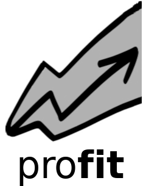

[](https://zenodo.org/badge/latestdoi/168945305)



# Probabilistic response model fitting via interactive tools

This is a collection of tools for studying parametric dependencies of 
black-box simulation codes or experiments and construction of reduced 
order response models over input parameter space. 

`profit` can be fed with a number of data points consisting of different 
input parameter combinations and the resulting output of the model under 
investigation. It then fits a response "surface" through the point cloud.
This probablistic response model allows to predict ("interpolate") the output 
at yet unexplored parameter combinations including uncertainty estimates. 
It can also tell you where to put more training points to gain maximum new 
information (experimental design) and automatically generate and start
new simulation runs locally or on a cluster. Results can be explored and checked 
visually in a web frontend.

Telling `profit` how to interact with your existing simulations is easy
and requires no changes in your existing code. Current functionality covers 
uncertainty quantification via polynomial chaos expansion 
with [chaospy](https://github.com/jonathf/chaospy) as a backend. Support for 
response surface / surrogate models via 
[GPflow](https://github.com/GPflow/GPflow) is under development. 
The web frontend is based on [plotly/dash](https://github.com/plotly/dash).

## Features

* Compute evaluation points to run simulation for UQ (full or sparse grid)
* Template replacement and automatic generation of run directories
* Starting parallel runs locally or on the cluster (SLURM)
* Collection of result output and postprocessing with UQ

## HowTo

Examples for different model codes are available under `examples/`:
* `mockup`: Simple model called by console command based on template directory.
* `hymod`: Model called as Python function via `PythonFunction` backend.
* `mossco`: More complex model called by console command based on template directory.
* `idealiron`: More complex model called by console command based on template directory.
* `algae`: Generation of evaluation points only (`input.txt`) without model run.

1. Create a directory `study` containing `profit.yaml` for your run.
   If your code is based on text configuration files for each run, copy the according directory to `template` and replace values of parameters to be varied within UQ/surrogate models by placeholders `{param}`.
   
2. Preprocessing:  
   ```
   profit pre
   ```
   to generate points where model is evaluated, and possibly run directories based on `template`.
   Evaluation points are stored inside `study/input.txt`
  
3. Running model: 
   ```
   profit run
   ```
   to start simulations at all the points. If `run.backend` is of type `PythonFunction`, results
   of model runs are stored in `study/output.txt`. Otherwise output is stored in model code-specific format.
  
4. Postprocessing: 
   ```
   profit post
   ```
   to get postprocessing results.
  
## User-supplied files

* `profit.yaml`
  * Add parameters and their distributions via `params`
  * Set `run.backend` to a class available inside `redmod.run`
  
* `interface.py`
  * `shape()` should return shape of the model output as a list of integers.
  * `get_output()` should return model output as a numpy array of shape `interface.shape()`.
    The current path is the respective run directory. Can be skipped if `run.backend` is of type `PythonFunction`.
