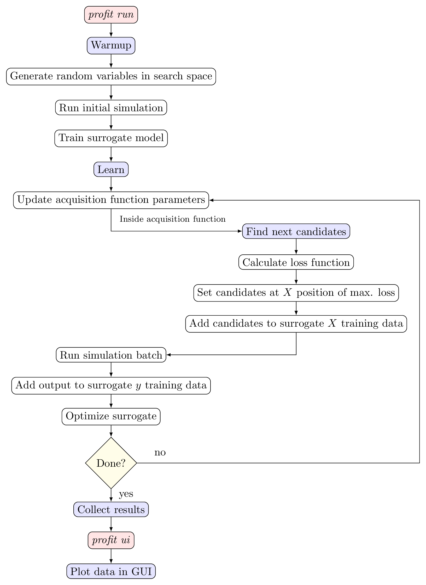

.. _active_learning:

Active Learning
===============

Besides running simulations and building surrogate models afterwards,
proFit provides algorithms to execute this simultaneously by active learning (AL).
AL allows to reduce the necessary number of training points to reach a specific fit quality
compared to sampling from a random or Halton distribution, as points can be
chosen directly where most information is gained.
proFit implements two algorithms by default, called ``SimpleAL`` and ``McmcAL``.
The former serves as the default active learning algorithm by which consecutive
points are chosen according to some acquisition function, like minimization of the
fit variance or finding the maximum of a function.

The second provided method is a Markov-Chain-Monte-Carlo (MCMC) algorithm,
which is a somewhat different use case of proFit, compared to the other
modes and the SimpleAL algorithm, as it makes use of already observed experimental
data and a parameterized model to find the posterior distribution of these
parameters, instead of fitting a non-parametric Gaussian process. It implements
the additional feature of delayed acceptance, which further reduces computational
effort. The MCMC algorithm is discussed separately in :ref:`mcmc`.

In the ``SimpleAL`` algorithm a ``warmup`` method is implemented, where initial
points are sampled randomly, to receive a first estimate of the surrogate model.
Thereafter in the ``learn`` method, where the main loop is contained, the acquisition
function finds the next best points which are injected into the run queue. The
model and fit are updated and the successive next best points are searched.
This workflow is shown graphically in the figure below:

    Active learning workflow

proFit automatically activates AL if the user inserts an ``ActiveLearning`` variable
inside the ``profit.yaml`` configuration file. The corresponding search interval
is given as parameter of the variable, defaulting to $[0, 1]$. As optional parameter,
the AL variable can be set to log-space, which means the search space is logarithmically
transformed. This especially makes sense if the user wants to explore a
large space. Multi-dimensional active learning is also possible by defining several
AL variables. In this multi-dimensional case, Gibbs sampling is used, as of now.
Furthermore, AL and non-AL variables can be combined to perform active learning
only in certain dimensions. The distinctive parameters of the AL algorithm and
acquisition functions are adjusted in the section ``active_learning`` of the config file.
A special parameter to be mentioned is the ``batch_size``, which allows to search for several
points in parallel. This is especially useful, as today’s computing clusters are much
better utilized if computing in parallel.

Acquisition functions
---------------------

The task of an acquisition function is to find points which yield the most
information according to a loss function and should be explored next by the simulation.
An overview of in proFit implemented acquisition functions and a short description
of their purpose is shown in the table below:

+---------------------------------------+--------------------------------------------------------------+
| | Acquisition function                | | Task                                                       |
| | (Identifier)                        | |                                                            |
+=======================================+==============================================================+
| | Simple exploration                  | | Minimize fit variance.                                     |
| | (simple_exploration)                | | Optional ``bool`` parameter: ``use_marginal_variance``.    |
|                                       | | take into account derivative of hyperparameters            |
|                                       | | (only for Custom surrogate).                               |
+---------------------------------------+--------------------------------------------------------------+
| | Exploration with distance penalty   | | Minimize fit variance.                                     |
| | (exploration_with_distance_penalty) | | Exponential penalization of nearby points with             |
|                                       | | the ``weight`` parameter.                                  |
+---------------------------------------+--------------------------------------------------------------+
| | Weighted exploration                | | Minimize variance.                                         |
| | (weighted_exploration)              | | Or maximize surrogate mean.                                |
|                                       | | Adjustable by the ``weight`` parameter.                    |
+---------------------------------------+--------------------------------------------------------------+
| | Probability of improvement          | | Find global maximum or minimum.                            |
| | (probability_of_improvement)        | | Adjustable exploration part to avoid confinement in        |
|                                       | | local extremum. (Parameter ``exploration_factor``)         |
+---------------------------------------+--------------------------------------------------------------+
| | Expected improvement                | | Find global maximum or minimum.                            |
| | (expected_improvement)              | | Adjustable exploration part to avoid confinement in        |
|                                       | | local extremum. (Parameter ``exploration_factor``)         |
+---------------------------------------+--------------------------------------------------------------+
| | Alternating exploration             | | Alternating simple exploration and expected improvement    |
| | (alternating_exploration)           | | during learning cycles.                                    |
|                                       | | Parameters of ``simple_exploration`` and                   |
|                                       | | ``expected_improvement`` as well as ``alternating_freq``   |
|                                       | | to indicate the frequency of changing between the          |
|                                       | | two acquisition functions.                                 |
+---------------------------------------+--------------------------------------------------------------+

Parallel active learning
------------------------

With today’s supercomputers, parallel computing has become an integral part
of numerical simulations. Even for expensive simulations it is thus more efficient
to select several points at once instead of evaluating one point after another. For
active learning this means also the search for candidates has to be parallelized to
find a next best batch instead of the next best point. For the simple exploration
acquisition function, this is done straightforwardly, as the predictive variance $\mathbb{V}$
does not depend on the actual simulation output $\mathbf{y}$:

.. math::
    \mathbb{V}[\mathbf{y}_*] = K_{**} - K_*^T (K + \sigma_n^2 I)^{-1} K_*

with $K = k(X, X)$ the training kernel matrix, $K_* = k(X_*, X)$ and $K_{**} = k(X_*, X_*)$.
$X$ represents the training input points, $X_*$ the prediction input points, $\mathbf{y}_*$ the prediction output
and $I$ the identity matrix and $\sigma_n$ the data noise.

For other acquisition functions that depend on the evaluated output $\mathbf{y}$, approximations with the predictive fit
itself, i.e. with $\mathbf{y}_*$, have to be made.

As an example, in the expected improvement acquisition function, the exploration and
exploitation parts are split, so the exploration can be fully parallelized and updated for
each point in the batch. The exploitation term, on the other hand, is approximated by the mean function
of the given surrogate model at the beginning, and is not updated throughout the batch.

Examples
--------

.. code-block:: yaml

    ntrain: 50  # Points in total (AL warmup + AL learn).
    variables:
        u: ActiveLearning()  # AL variable in interval [0, 1].
        v: ActiveLearning(1e-4, 1, Log)  # AL variable with log search space.
        mu: Normal(0, 0.2)  # Non-AL variable (Gaussian distributed).
        f: Output  # Scalar output.

    run:
        ...  # Usual run configuration

    fit:
        surrogate: GPy  # Use this surrogate during AL.

    active_learning:
        nwarmup: 10  # Randomly sampled warmup points.
        batch_size: 1  # Sequential learning.
        algorithm:
            class: simple  # SimpleAL
            acquisition_function: simple_exploration  # Minimize fit variance.

.. code-block:: yaml

    ...
    active_learning:
        nwarmup: 4
        batch_size: 16  # Parallel learning
        algorithm:
            class: simple
            acquisition_function:
                class: alternating_exploration  # Alternate `simple_exploration` and `expected_improvement`
                exploration_factor: 0.1  # Exploration factor for expected improvement.
                find_min: True  # Find function minimum instead of maximum.
                alternating_freq: 2  # Do exploration twice, then expected improvement twice.
