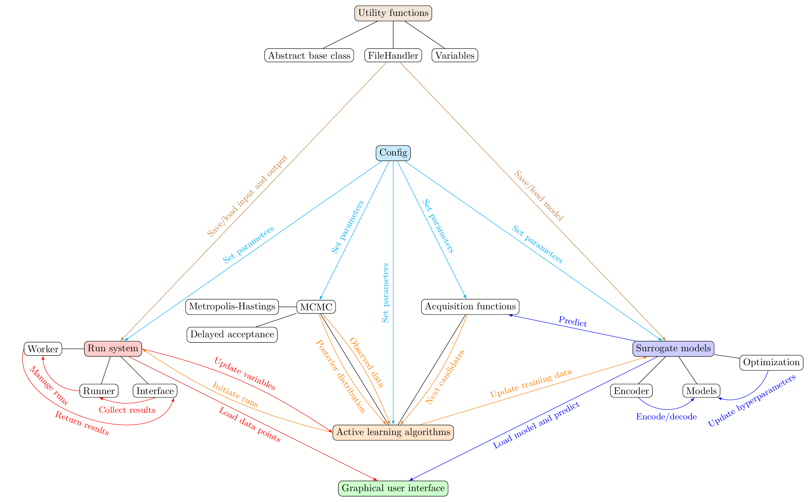

Code structure
##############

The package consists of six main modules:

* Run system
    Start and manage simulation runs and collect the results.
* Surrogate models
    Encode and fit the data.
* Active learning algorithms
    Combine run system and surrogate modelling to consecutively find next input points.
* User interface
    Interactively view the results and fit in a Dash web server.
* Configuration
    Read and standardize user inputs from supplied files.
* Utility functions
    Definition of an abstract base class, variables and other useful functions.

    proFit code structure
