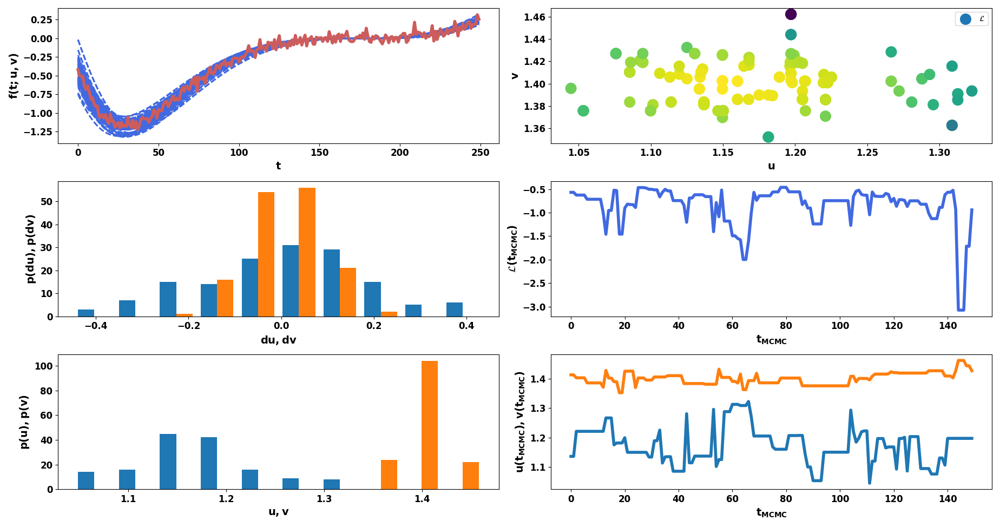

.. _mcmc:

Markov-Chain Monte-Carlo
========================

The Markov-Chain-Monte-Carlo algorithm (MCMC) is closely related to active learning but
candidate points are sampled from a distribution and either accepted or rejected according to
their posterior probability rather than actively learned.
Furthermore, MCMC focuses on finding the highest posterior distribution of the parameters in place
of optimizing a loss function as in active learning.

Given observed data and a simulation model with certain (physical) parameters, an MCMC simulation estimates the best posterior distribution
of these parameters.

The ingredients to an MCMC algorithm are the following:

* Data
    Observed (experimental) data. Which path is given in the configuration as parameter ``reference_data``.
* Model simulation
    Usual simulation to model the observed data with parameter vector $\theta$.
* Sampling algorithm
    Method, how next input points to the simulation are chosen.
    In proFit the Metropolis-Hastings algorithm is used.
* Likelihood function
    Function to compare candidate points with already sampled points.
    In proFit, a Gaussian likelihood is chosen.

As the initial MCMC point starts at a random position in search space, warmup
cycles are necessary to reach the desired area of high posterior probabilities. A
widely used target acceptance rate of accepted versus rejected points is the well
known asymptotically optimal target acceptance rate of $0.234$. This value has to be
treated with caution, as there may be significantly better suited acceptance rates for a
particular problem. The target acceptance rate can be adjusted in the configuration with the
parameter ``target_acceptance_rate``.
Given a specific target acceptance rate, the step size of how far in some direction in parameter
space the next point is chosen, is adapted throughout the warmup cycles. After all warmup cycles are
complete, the warmup points are discarded and the actual MCMC run, which yields the final posterior
distribution with uncertainties for the parameters, is executed. The config parameter ``last_percent``
specifies which fraction of the main MCMC run is used for calculating the mean and variance of the posterior distribution.
This lasts normally until a convergence criterion is satisfied or the
maximum number of MCMC runs is reached. The log-likelihoods of each step are saved to
``./log_likelihohod.txt`` and the parameter's final mean and standard deviation are saved to ``./mcmc_stats.txt``.

A special feature of the proFit MCMC algorithm is delayed acceptance (DA),
which uses a surrogate model of the loss function to estimate its expected minimum
and can thus reject prospected MCMC points by the surrogate model, already
before an (expensive) simulation run is started, which can reduce computation time.
As of now, DA can be utilized only after the first warmup cycle. Before, points are accepted
or rejected only by running the simulation. It is planned to use the ``SimpleAL``
active learning algorithm to also sample the first points intelligently.
Delayed acceptance can be activated in the configuration by setting the parameter
``delayed_acceptance``.

Results
-------

Setting the parameter ``make_plot`` in the ``active_learning`` section plots the
MCMC results for each warmup cycle and the main MCMC loop.

    Example MCMC results.
    Upper left: Experimental data (red) and simulation evaluations with two parameters (blue).
    Middle left: Distribution of step sizes for each MCMC step per parameter.
    Lower left: Posterior distribution of parameter values.
    Upper right: Likelihood for each observed sample.
    Middle right: Likelihood as function of MCMC steps.
    Lower right: Parameter values as function of MCMC steps.

Examples
--------

.. code-block:: yaml

    ntrain: 1000  # Total number of training points.
    ...
    active_learning:
        nwarmup: 50  # Number of warmup points per cycle
        algorithm:
            class: mcmc
            reference_data: ./experimental_data.txt
            warmup_cycles: 5
            target_acceptance_rate: 0.35
            sigma_n: 0.05  # Estimated data noise (standard deviation)
            initial_points: [0.5, 1]  # Starting points for each dimension. If None, randomly chosen in search space.
            last_percent: 0.25  # Last points used to calculate mean and variance of posterior.
            save: ./mcmc_model.hdf5  # Save MCMC model path.
            delayed_acceptance: True  # Use delayed acceptance with surrogate specified in `fit` configuration.
