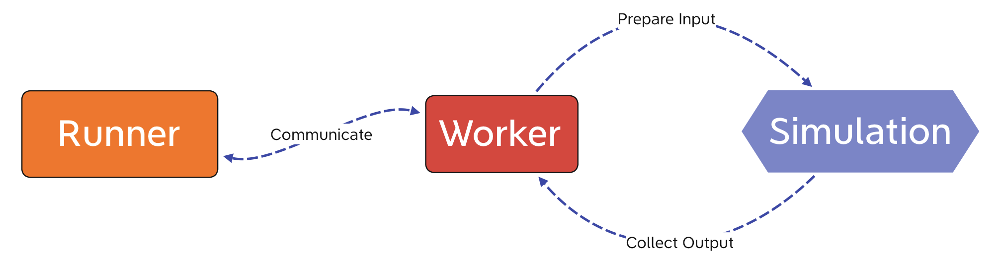
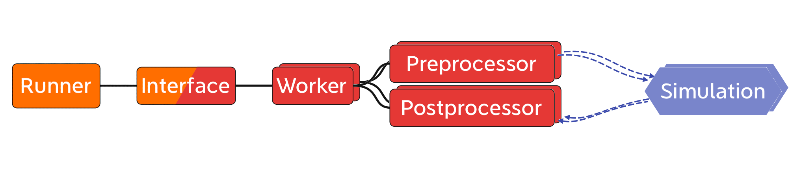

.. _run_system:

The Run System
##############

This documentation was taken directly from: R. Babin, "Generic system to 
manage simulation runs and result collection for distributed parameter 
studies", Bachelor's Thesis (Graz University of Technology, Graz, Austria, 
2021)

--------------

A core feature of *proFit* is the ability to start and manage simulations. This
part of *proFit* is referred to as the *run system*. A particular design
challenge is the balancing of two often conflicting interests: on one
side, *proFit* should do as much as possible automatically to reduce the work
which the user has to do and on the other side, *proFit* should be customizable
to meet specific needs a user might have.

Requirements
------------

The primary use of the run system is sampling the parameter space in an
effective manner. The system should therefore take arrays of input
parameters, launch the simulation in parallel for each set of parameters
and return the output data when the simulations have completed.
Additionally, advanced fitting methods (e.g. *active learning*)
iteratively determine which parameters should be scheduled next. In the
future an interactive user interface should allow starting new
simulations as well as monitoring currently scheduled or running ones.

It should not be necessary to adjust the simulation to be able to use it
with . Therefore it has to be possible to configure how *proFit* supplies the
simulation with input arguments and how the output data is collected. In
addition to supporting a few common methods, the user should have the
possibility to customize *proFit* to support any simulation.

Large simulations require many resources and are mostly run on clusters.
The run system should be designed to schedule jobs on a given cluster
and needs to be able to communicate with the simulations in a
distributed manner. The other extreme use case for *proFit* would be a large
number of inexpensive simulations running locally, which require the run
system to have as little overhead as possible.

Finally, the program structure and API should be clean and organized to
facilitate open source contributions and allow a later expansion of this
system. The configuration and customization should also be cleanly
structured and easy to understand even for new users.

Design
------

To fulfill the requirements above, it was decided to use a modular
design with generic components. A *Runner* should manage all the
simulation runs and start the simulations, while each of them is managed
by a *Worker*. The *Worker* prepares the input for the simulation and
collects its output after it has completed. To make the previously
generated or user supplied parameters available to the simulation and to
collect all the outputs together, the *Runner* needs to communicate with
all simultaneously running *Workers*. This preliminary design is drawn
in figure 1.

   
   Figure 1: Preliminary design of the *proFit* run system.

To support arbitrary simulations, the processes of preparing the input
for the simulation and collecting its output need to be handled by
generic (and thereby adaptable) components. Depending on the system on
which the simulations should be run, the method of starting the
simulations (or more precisely starting the *Workers*, which is done by
the *Runner*) and the method of communication need to be adaptable.
Finally, for reasons of symmetry and to reduce the overhead for
simulations written in *Python*, the *Worker* should be generic and
adaptable as well. To meet these requirements, the run system was
divided into five generic components (see figure 2) which can
come in different variations.

   
   Figure 2: The components of the *proFit* run system.

The central component is the *Runner* which interacts with the user and
manages the individual runs. Each simulation run is represented by a
*Worker* while an *Interface* provides the communication between the
*Runner* and all *Workers*. The *Interface* consists of two strongly
interacting parts which handle the *Worker* and *Runner* side
respectively. To supply the input arguments to the simulation, the
*Worker* uses a *Preprocessor* and to collect the output data a
*Postprocessor* is used. The *Runner* and its corresponding part of the
*Interface* are persistent while the other components exist for each run
of the simulation separately.

Starting ``profit run`` initializes the *Runner* together with its
corresponding *Interface*. When the user requests a new run, the
*Runner* spawns a new *Worker*. This new *Worker* initializes itself
with the provided configuration and environment and also initializes its
part of the *Interface*. Then the *Preprocessor* is started with the
input arguments which the *Runner* transmits via the *Interface*. The
*Worker* is now ready and starts the simulation. After the simulation
has completed, the *Postprocessor* reads the simulation’s output and
passes the collected data via the *Interface* back to the *Runner*.
Finally, the *Worker* signals the *Runner* that the run is completed and
ensures that everything is cleaned before it exits.

Each variant of a component is marked with an identifier which allows
the user to select the variant in the configuration using this
identifier. Each component (except for the *Worker*) has its independent
section in the configuration. A user can add custom variants in the
exact same way the default components are implemented by specifying the
file with the custom components in the configuration. As this approach
allows the user to execute arbitrary code, *proFit* should never be run in a
privileged mode.

Implementation
--------------

Each component was implemented using classes in *Python* with each
variant being a subclass of the respective abstract base class  [1]_.
The *Worker* is an exception to this, as the default *Worker* is the
base class and a custom implementation would subclass it and overwrite
only specific methods. The two parts of the *Interface* are represented
by two separate class hierarchies, which work in parallel using the same
identifiers.

To facilitate adding new variants and to allow the user to provide a
custom variant of a component, a class-decorator was provided for each
component which registers the new variant so that it can be called using
its identifier. To select a specific variant of a component, it’s
identifier has to be selected in the configuration as the respective
component’s *class* (see for example listing 2). For the
most commonly customized components *Preprocessor*, *Postprocessor* and
*Worker*, which all override only a single method in most cases, an
additional function-decorator was provided which wraps a given function
to provide the same functionality as the subclass with minimal effort
(see for example listing 3).

The default components of *proFit* are implemented using the same decorators and
one of the default components, the *JSON Postprocessor* is given in
listing 1. The *post* method is the main method which is
called to process the simualtion’s output while *handle\_config* is used
to process the *post*-section of the config file. An example of this
*post*-section where the *JSON Postprocessor* was selected is given in
listing 2.

::

    @Postprocessor.register('json')
    class JSONPostprocessor(Postprocessor):
        """ Postprocessor to read output from a JSON file

        - variables are assumed to be stored with the correct key and able to be converted immediately
        - not extensively tested
        """
        def post(self, data):
            import json
            with open(self.config['path']) as f:
                output = json.load(f)
            for key, value in output.items():
                data[key] = value

        @classmethod
        def handle_config(cls, config, base_config):
            """
            Example:
                .. code-block:: yaml

                    class: json
                    path: stdout    # file to read from, relative to the run directory
            """
            if 'path' not in config:
                config['path'] = 'stdout'

*Listing 1: Registering a Postprocessor with the identifier json, to read simulation output in the JSON file format. Part of the default components of proFit* [proFit]_.

::

    run:
        post:
            class: json
            path: simulation_output.json
        include: path/to/my_custom_json_postprocessor.py

*Listing 2: The post-section of the YAML-configuration file to select the JSON Postprocessor defined in listing 1.*

Usually a user shouldn’t have to create a custom *Worker*, but to reduce
the overhead for a simulation or for testing purposes it might be
beneficial to let the *Worker* call a *Python* function directly instead
of starting a simulation via a system call. An example for a *Worker*
subclass, which uses a simple function instead of a complicated
simulation, is given in listing 3, using the *wrap*-decorator
discussed earlier to reduce the necessary code overhead (see
listing 4 for the corresponding configuration).

::

    @Worker.wrap('new_worker', 'u', 'f')
    def simulation(u):
        return np.cos(10 * u) + u

*Listing 3: Registering a new Worker with the identifier python_worker, the input parameter u and output value f = cos(10 u) + u using the wrapper. Adapted from the tests of proFit* [proFit]_.

::

    run:
        worker: new_worker
        include: path/to/my_custom_worker.py

*Listing 4: The YAML configuration to select the custom Worker defined in listing 3. Adapted from the tests of proFit* [proFit]_.

Components
----------

A number of default components were added to provide basic functionality
and to fulfill the different requirements.

Template Preprocessor
~~~~~~~~~~~~~~~~~~~~~

The *Template Preprocessor* copies a given template directory for each
run and replaces special template variables within the files with the
generated values for this run. Simulations which read input parameters
from files can be supplied with different variables in this way easily.
This functionality has been a part of *proFit* before, but has been adapted to
the new system and received some small improvements. With this default
component all current *Preprocessor* requirements are fulfilled and no
additional variant is needed.

Postprocessors
~~~~~~~~~~~~~~

Many simulations use a tabular format (e.g. *CSV*) for their output
files. With the *Numpytxt Postprocessor* most of them can be processed
easily and configuration options can be passed directly to the
underlying ``numpy.genfromtxt`` function. Two other commonly used file
formats, *JSON* and *HDF5*, are also supported with their respective
*Postprocessors* to showcase the relative ease of adding new components.

Local Runner
~~~~~~~~~~~~

The *Runner* is the core of the run system and by default it executes
the *Workers* locally. A new simulation run is therefore launched in a
separate process, but this causes a significant overhead for very fast
simulations as the newly started *Python* process needs to reload all
packages. To circumvent this, the *Local Runner* now uses forking which
allows the child process (a *Worker*) to inherit the loaded package with
little overhead.

Slurm Runner
~~~~~~~~~~~~

One of the core goals of this project was the utilization of the cluster
scheduler *Slurm* instead of the local system. With the *Slurm Runner*
each run of the simulation is scheduled as a job with groups of runs
being scheduled as *job arrays*. The scheduler can be queried at
specified intervals (preferably longer intervals to reduce the load on
the scheduler) to detect failed or cancelled jobs. Parallelised
simulations using *OpenMP* are supported, as well as passing arbitrary
options through to the *Slurm* scheduler, like the job’s required
memory. By default the *Slurm Runner* generates a *Slurm script*, but it
can be configured to take a user supplied script instead.

Memmap Interface
~~~~~~~~~~~~~~~~

The default *Interface* uses a memory mapped file which allows all
*Workers* and the *Runner* to access the same *numpy array*. Special
care was taken to ensure that each component only accesses a small part
of the mapping and each part is only written from one place to prevent
race conditions.

ZeroMQ Interface
~~~~~~~~~~~~~~~~

On a cluster, a file based *Interface* is problematic as the distributed
file system is not fully synchronized. The *ZeroMQ Interface* uses the
lightweight message queue *ZeroMQ*  [2]_ instead. The required
information is transmitted using binary messages over a configurable
transport system (by default *tcp*), which allows efficient
communication across the network.

.. [1]
   An *abstract base class* defines the relevant methods and attributes
   but has no implementation and cannot be instantiated. Only subclasses
   which implement all abstract methods can be instantiated.

.. [2]
   The homepage of *ZeroMQ* is found at https://zeromq.org

.. [proFit]
   C. Albert, R. Babin, M. Hadwiger, M. Kendler, M. Khallaayoune, K. Rath, and B. Rubino-Moyner, "proFit v0.4: Probabilistic Response Model Fitting with Interactive Tools", 10.5281/zenodo.4849489 (2021)
