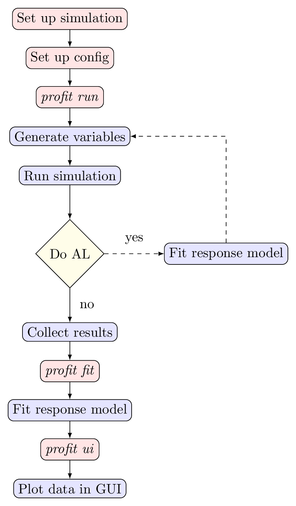

.. _start:

Getting Started
===============

This guide aims to give a rough overview over a full proFit workflow. Further examples of the configuration can be found in ``examples/`` and in ``tests/integration_tests/``.

   The typical profit workflow

The Configuration File
----------------------

proFit is controlled almost entirely via a single configuration file which is usually called ``profit.yaml``. Other filenames are permitted and the respective path can be given as an argument to the profit commands. The configuration is typically written using the YAML file format.

The configuration uses mostly a hierachical structure closely mirroring the structure of the different components. Different implementations of the same component are usually selected using the ``class`` attribute. A shorter notation uses the label of the component directly and uses default values for all it's parameters. The following two snippets therefore are the same:

.. code-block:: yaml

    run:
      interface:
        class: zeromq

.. code-block:: yaml

   run:
     interface: zeromq

There are also shorthand notations for Variables and Encoders.

Set up simulation
-----------------

proFit currently distinguishes two types of simulations:

* executables with input and output files
    | the simulation reads its input parameters from a file, proFit prepares the file using a ``Preprocessor``
    | the simulation writes its ouput values to a file, proFit read the file using a ``Postprocessor``

* Python simulations which are called from a function
    | the input parameters are the arguments of the function
    | the output parameters are the return values
    | proFit can wrap this function using a custom ``Worker``

For both of these, the first step is usually ensuring that they are installed properly and run within a dedicated working directory. Find out which environment variables need to be set and link all relevant files. This directory will become the template directory which proFit will (usually) copy for each run of the simulation. Furthermore the simulation will just inherit the environment proFit was started in. A typical directory structure could look like this:

.. code-block::

   study/
     profit.yaml
     template/
       simulation.x  ->  /path/to/simulation/executable.x
       params.txt

Variables
---------

The configuration file usually begins with ``ntrain:`` which set the desired number of data points. The next section is usually ``variables``. In it the different input parameters and output values are defined. For the parameters a suitable distribution from which the samples will be taken is selected. Additionally independent variables allow the output values to be vectors and constant values can also be set directly from proFit. More details can be found in :ref:`variables`.

.. code-block:: yaml

    ntrain: 100
    variables:
      u: Uniform(4.7, 5.3)
      v: Uniform(0.55, 0.6)
      n: 10000
      f: Output
 

Pre- & Postprocessor
--------------------

An executable simulation needs a ``Preprocessor`` and ``Postprocessor`` to prepare the input parameters and collect the results.

The recommended Preprocessor is the :py:class:`profit.run.default.TemplatePreprocessor` which will fill placeholders in the template directory with the corresponding values.

For the output values proFit currently supports JSON, HDF5 and CSV/TSV via three different Postprocessors. All the configuration options are given in :ref:`config`. A possible configuration is given below:

.. code-block:: yaml

    run:
      command: ./simulation
      pre:
        class: template
        path: ./path/to/template_directory
        param_files:
          - params.txt
      post: json

The contents of ``params.txt`` could look like this:

.. code-block::

    # just a plain csv
    # u, v, n, m
    {u}, {v}, {n}, 10

Python Simulation
-----------------

For a simulation which can be called from python directly, the recommended configuration is different and uses :ref:`extensions` instead. A python function ``simulation`` which takes the input parameters as arguments and returns the output values can be registered with proFit in the following way:

.. code-block:: python

   from profit.run import Worker

   @Worker.wrap("my_name")
   def simulation(u, v) -> "f":
       ...

The type annotation is used to tell proFit which return value belongs to which return value if there are several. The configuration is then:

.. code-block:: yaml

   run:
     worker: my_name

Interface & Runner
------------------

The other two main components of the run system are the ``Interface`` and the ``Runner`` itself. These play a vital role if the simulation should be scheduled on a cluster, rather than run locally. For more information see :ref:`cluster`.

Next steps
----------

Everything should be ready to run now:

* calling ``profit run`` will start start ``ntrain`` simulations with different parameters and collect their results

* calling ``profit fit`` will then use these results to fit a surrogate model which is configured in the ``fit`` section (see :ref:`surrogates`)

* with :ref:`active_learning` enabled, the fit will already happen during the run step. Active Learning optimizes the paramters at which the simulation is run to gain as much value per simulation run as possible

* finally the results can be explored interactively in a browser after starting a ``plotly/dash`` server using ``profit ui`` (see :ref:`ui`)

There is a wide variety of configuration options to customize the run system, the surrogate fitting and the active learning algorithm. Please have a look at the documentation on the :ref:`config` and don't hestitate to contact the developers if you encounter any bugs.

