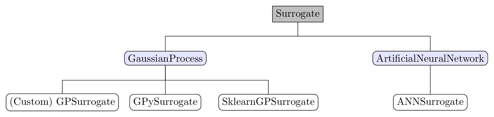

.. _surrogates:

Surrogate models
================

Overview
--------

Fitting the data with the command ``profit fit`` is accomplished by
Gaussian process regression (GPR) surrogate models.

Currently, there are three such models implemented in proFit, which differences are explained further below:

* Custom (built from scratch in proFit)
* GPySurrogate (based on `GPy <https://github.com/SheffieldML/GPy>`_)
* SklearnGPSurrogate (based on `scikit-learn <https://github.com/scikit-learn/scikit-learn>`_)

There are also two multi-output models:

* CustomMultiOutputGP (based on the Custom surrogate)
    Implements simple, independent GPs in every output dimension.
* CoregionalizedGPy (based on the GPySurrogate)
    Uses the coregionalization kernel from GPy to model dependencies between outputs.

Under development:

* Artificial neural network surrogate (using `PyTorch <https://github.com/pytorch/pytorch>`_)

Design
------

The hierarchy of implemented models is shown in the figure below. The universal
``Surrogate`` class is the overall base class of surrogates, which functions as abstract
base class where models are registered. For experienced users, this allows implementing
fully customized surrogates, starting from importing one of the available
classes and modifying only one method, to writing new classes from scratch which
integrate in the workflow by standard methods like ``train``, ``optimize``, ``predict``,
``save_model``, and ``load_model``. These methods are used throughout every sub
class to ensure compatibility between surrogates, encoders, and active learning
algorithms:

* ``train``
    Trains the model on a dataset.
    After initializing the model with a kernel function and initial hyperparameters,
    it can be trained on input data $X$ and observed output data $\mathbf{y}$ by
    optimizing the model’s hyperparameters, which is done by minimizing the
    negative log-likelihood.
* ``optimize``
    Finds the optimal hyperparameters of the model to ensure consistency with
    observed data.
* ``predict``
    Predicts the output at test input points $X_*$ by building the posterior mean
    and covariance using previously trained data.
* ``save_model``
    Saves the model and used encoding as Python dictionary to a `.hdf5` file. For
    the coregionalization multi-output surrogate from GPySurrogate , a `.pkl`
    file is used instead.
* ``load_model``
    Loads a saved model from a `.hdf5` (or `.pkl`) file, updates its attributes and
    restores the encoding.

To be able to use the surrogate in active learning, another two methods are necessary:

* ``add_training_data``
    Adds $X$ and $\mathbf{y}$ data to the model.
* ``add_ytrain``
    Overwrites the placeholder $\mathbf{y}$ data inserted during active learning with the actual data.

    Surrogate hierarchy. Grey: base class, blue: intermediate helper class,
    white: user selectable classes.

Each of the above mentioned GP surrogate models has its own advantages, the
most important of which for the use in proFit are displayed in the following table:

+----------------------+---------------------------------------------------------+
| | Surrogate          |   | Advantages                                          |
| | (Identifier)       |   |                                                     |
+======================+=========================================================+
| | GPSurrogate        | | Built from scratch.                                   |
| | (Custom)           | | Well suited for study purpose.                        |
|                      | | Customizable kernels in Python and Fortran.           |
|                      | | Customizable optimization (Laplace approximation,     |
|                      | |   include derivatives, etc.).                         |
+----------------------+---------------------------------------------------------+
| | GPySurrogate       | | Large number of selectable models and kernels.        |
| | (GPy)              | | Multi-output models with coregionalization available. |
|                      | | Small package size.                                   |
+----------------------+---------------------------------------------------------+
| | SklearnGPSurrogate | | Low level customization possible.                     |
| | (Sklearn)          | | Good integration with other scikit-learn libraries.   |
+----------------------+---------------------------------------------------------+

Kernels
-------
For the ``GPySurrogate`` and the ``SklearnGPSurrogate`` the respective kernels of their packages can be
called by their corresponding class name.
The kernels of the custom ``GPSurrogate`` are implemented by default in Python and Fortran,
where the `RBF <https://en.wikipedia.org/wiki/Radial_basis_function_kernel>`_,
`Matern32 <https://en.wikipedia.org/wiki/Mat%C3%A9rn_covariance_function>`_ and
`Matern52` kernels are available as of now.

The automatic relevance detection (ARD) feature of the GPy kernels can be used
for dimensionality reduction, as dimensions with large length-scales are excluded from the fit which
makes the model less complex.

Encoders
--------

Encoding of input and output data is an important topic as well, as it can make
surrogate models more reliable. The most important encodings in proFit include

* Normalization
    The fit is always executed on the $n$-dimensional $1$-cube with
    zero mean and unit variance, which usually makes the surrogate models
    more reliable for data with a large range. It is also planned to implement
    an encoder to handle heteroscedastic data.
* Exclusion
    Specified dimensions of the data are neglected from the beginning which
    makes the fitting procedure more efficient, as less dimensions have to be
    considered.
* Log10
    The transformation $log(x)$ is applied which can reduce model complex-
    ity, as e.g. a linear model can be fitted instead of an exponential one.
* Dimensionality reduction
    Transformations can be applied, e.g. principal component analysis (PCA)
    and Karhunen-Loeve decomposition (KL) which contribute to minimizing computational
    effort of fitting high dimensions.
    The difference between PCA and KL here is that PCA is conducted with the collocation matrix
    $M=X^T \cdot X$ which is efficient if the number of samples is greater than the number of variables,
    while KL uses the covariance matrix $C=X \cdot X^T$ which is efficient if the number of variables is larger
    than the number of samples.

By default, the following encoder pipeline is used:

1. Exclude ``Constant`` input variables
2. Logarithmically transform ``LogUniform`` input variables
3. Normalize all input variables
4. Normalize all output variables

Custom encoders can be registered to the base ``Encoder`` class, as described generally in
:ref:`extensions`.

Examples
--------

.. code-block:: yaml

    fit:
        surrogate: GPy
        save: model.hdf5  # Automatically becomes model_GPy.hdf5 for identification.
        fixed_sigma_n: False  # Fix noise in the beginning.
        kernel: RBF  # Also possible, e.g.: `Matern32`, `Matern52`, etc.
        hyperparameters:  # Initial hyperparameters. Inferred from training data if not given.
            length_scale: 0.1
            sigma_f: 1.0
            sigma_n: 0.01
        encoder:
            - Exclude(Constant)  # Applied on `Constant` variables.
            - Log10(LogUniform)  # Applied on `LogUniform` variables.
            - Normalization(all) # Applied on all input and output variables.

.. code-block:: yaml

    fit:
        surrogate: CoregionalizedGPy  # Use coregionalization multi-output surrogate.
        save: model_CoregionalizedGPy.pkl  # Only saving to `.pkl` is implemented for this surrogate.
        encoder:
            - Log10(input)  # Transform all input variables.
            - KarhunenLoeve(output)  # Use dimensionality reduction encoder on output.
            - Normalization(all)  # Normalize all input and output variables.

.. code-block:: yaml

    fit:
        surrogate: GPy
        load: model_1.hdf5  # Load already trained model.
